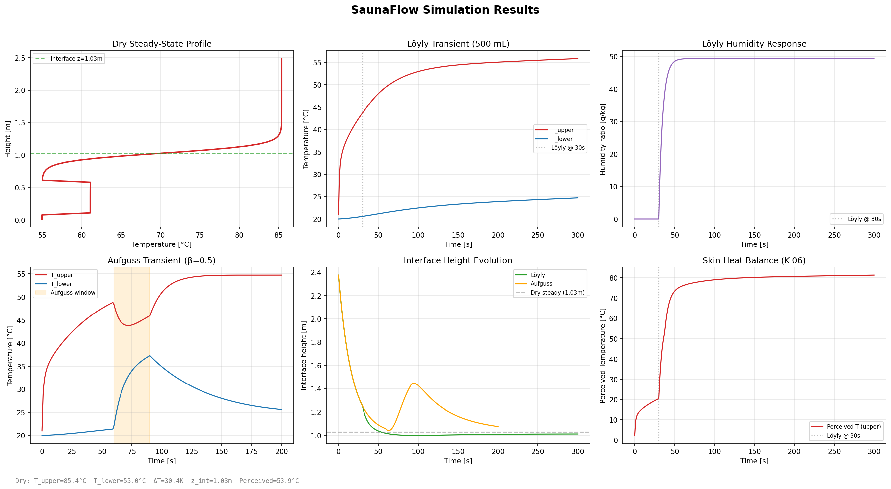
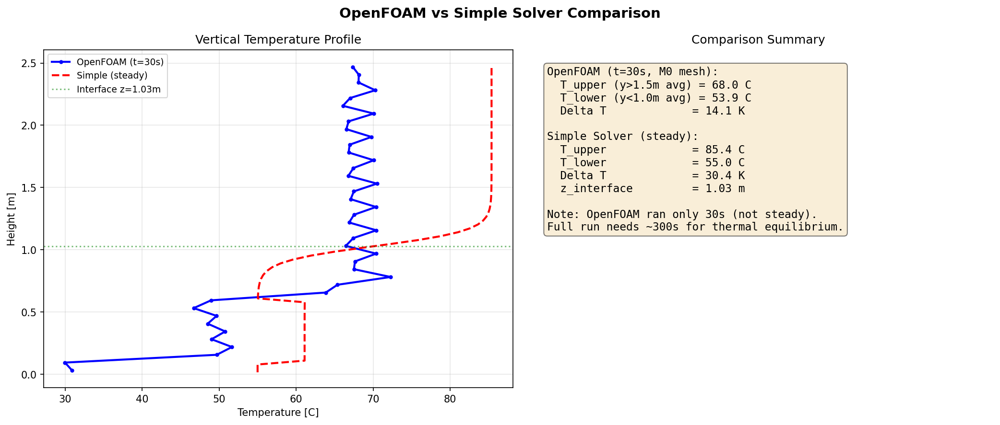

# SaunaFlow プロジェクト現状報告

**報告日**: 2026-04-05
**リポジトリ**: `d:\dev\SaunaFEM` (branch: `main`, 77 commits)
**テスト状況**: 181 テスト全通過 (20.25s)

---

## 1. プロジェクト概要

### 目的

SaunaFlow は、サウナ室内の熱環境を CFD シミュレーションで予測・検証するための Python ハーネス駆動ツールである。OpenFOAM を計算エンジンとし、YAML 宣言的ケース定義から自動でケース生成・実行・KPI 算出・検証レポートまでを一貫して行う。

### アーキテクチャ

**2ソルバー構成**:

| ソルバー | 種別 | 次元 | 方程式 | 用途 |
|----------|------|------|--------|------|
| OpenFOAM buoyantPimpleFoam | 正確版 | 3D | N-S + エネルギー + SST k-omega | 本計算・検証 |
| simple_solver.py (2-Zone) | 簡易版 | 0D (2層集中定数) | Zukoski プルーム + エネルギー保存 | パラメータスタディ・初期場生成 |

**ハーネス駆動の原則**: ハーネス (Python) が全てを制御し、OpenFOAM は計算エンジンに過ぎない。全ケース設定は YAML で宣言的に定義され、同一入力から同一結果が再現可能である。

### フェーズ計画と現在地

| Phase | 内容 | 状況 |
|-------|------|------|
| Phase 0 | プロジェクト基盤（ディレクトリ構成、YAML スキーマ、CLI） | **完了** |
| Phase 1 | ドライサウナ定常状態（温度成層、ヒーター、プローブ） | **完了** |
| Phase 2 | ロウリュ導入（過渡、蒸気源、ピーク応答） | **簡易版完了 / OpenFOAM テンプレート準備済** |
| Phase 3 | アウフグース導入（ジェット/モーメンタム、局所風・熱） | **簡易版完了 / OpenFOAM テンプレート準備済** |
| Phase 4 | 実験検証（センサー設置、CSV 取込、比較） | 未着手 |
| Phase 5 | 比較自動化（バッチ比較、自動レポート） | 未着手 |

---

## 2. 支配方程式の整備状況

支配方程式は `docs/governing_equations.tex` (LaTeX) および PDF (`docs/governing_equations_latest.pdf`) として整備済み。数式とコード実装の全項目一致を確認済み。

### 2.1 正確版 (OpenFOAM buoyantPimpleFoam)

**連続の式**:

$$\frac{\partial \rho}{\partial t} + \nabla \cdot (\rho \mathbf{U}) = 0$$

**運動量保存 (Navier-Stokes)**:

$$\frac{\partial (\rho \mathbf{U})}{\partial t} + \nabla \cdot (\rho \mathbf{U} \otimes \mathbf{U}) = -\nabla p_{rgh} + \rho \mathbf{g} + \nabla \cdot [\mu_{\text{eff}} (\nabla \mathbf{U} + (\nabla \mathbf{U})^T - \frac{2}{3}(\nabla \cdot \mathbf{U})\mathbf{I})]$$

- $p_{rgh} = p - \rho \mathbf{g} \cdot \mathbf{r}$（修正圧力）
- $\mu_{\text{eff}} = \mu + \mu_t$

**エネルギー保存**:

$$\frac{\partial (\rho h)}{\partial t} + \nabla \cdot (\rho \mathbf{U} h) = \nabla \cdot (\alpha_{\text{eff}} \nabla T) + q_{\text{source}}$$

- $h = c_p T$（sensibleEnthalpy 形式）
- $\alpha_{\text{eff}} = \mu/Pr + \mu_t/Pr_t$

**乱流モデル: SST k-omega (Menter)**:

$$\frac{\partial (\rho k)}{\partial t} + \nabla \cdot (\rho \mathbf{U} k) = \nabla \cdot [(\mu + \sigma_k \mu_t) \nabla k] + P_k + G_b - \beta^* \rho k \omega$$

浮力生成項:

$$G_b = -\frac{\mu_t}{\rho \, Pr_t} (\mathbf{g} \cdot \nabla \rho)$$

- fvOptions の codedSource で k 方程式に注入（omega 方程式への浮力項は未追加）
- 安定成層: $G_b < 0$ (乱流抑制)、不安定成層: $G_b > 0$ (乱流促進)

**状態方程式**: $\rho = pM_w / (RT)$（perfectGas、$M_w = 28.96$ g/mol）

### 2.2 簡易版 (2-Zone プルームモデル)

建築環境工学の標準的な 2 層ゾーンモデル。Morton-Taylor-Turner (MTT) エントレインメント理論 + Zukoski プルーム相関式に基づく。

**プルーム質量流量 (Zukoski 相関式)**:

$$\dot{m}_p(z_{\text{eff}}) = 0.071 \, Q_c^{1/3} \, z_{\text{eff}}^{5/3} + 0.0018 \, Q_c$$

**Heskestad 仮想原点補正**:

$$z_0 = -1.02 \, D + 0.083 \, Q_c^{2/5}, \quad z_{\text{eff}} = \max(0.01, z - z_0)$$

**上層エネルギー保存**:

$$\rho_{\text{upper}} c_p V_{\text{upper}} \frac{dT_{\text{upper}}}{dt} = \dot{m}_p c_p (T_{\text{plume}} - T_{\text{upper}}) - h_{\text{wall}} A_{\text{wall,upper}} (T_{\text{upper}} - T_{\text{wall}}) + Q_{\text{rad}} F_{\text{upper}}$$

**界面質量保存**:

$$A_{\text{floor}} \frac{dz_{\text{int}}}{dt} = -\frac{\dot{m}_p}{\rho_{\text{upper}}} + \dot{V}_{\text{return}} - \dot{V}_{\text{steam}} + \dot{V}_{\text{mix}}$$

**温度プロファイル (シグモイド補間)**:

$$T(y) = T_{\text{lower}} + \frac{T_{\text{upper}} - T_{\text{lower}}}{1 + \exp(-3 \cdot \frac{y - z_{\text{int}}}{\delta/2})}$$

- $\delta = 0.15 H$（遷移層厚さ）

### 2.3 皮膚熱収支モデル (K-06)

KPI K-06 の体感温度算出に使用。Steadman (1979) の屋外ヒートインデックスではなく、サウナ高温域 (60-120 degC) で有効な物理ベースモデルを独自実装:

$$T_{\text{eq}} = T_{\text{skin}} + \frac{q_{\text{conv}} + q_{\text{rad}} + q_{\text{evap}}}{h_{\text{ref}}}$$

- $q_{\text{conv}} = h_{\text{conv}} (T_{\text{air}} - T_{\text{skin}})$
- $q_{\text{evap}}$: Lewis 関係式による蒸発冷却/結露加熱
- $q_{\text{rad}}$: ヒーターからの直接輻射（Stefan-Boltzmann + 形態係数）

### 2.4 数式とコードの整合性

全方程式項について `governing_equations.tex` と `simple_solver.py` の実装コードを照合し、以下を確認済み:

- Zukoski 相関式の係数 (0.071, 5/3, 0.0018) — 一致
- Heskestad 仮想原点 (-1.02D, 0.083) — 一致
- 界面方程式の全4項（プルーム、リターン、蒸気膨張、混合） — 一致
- 壁面集中定数モデルの導出式 — 一致
- 皮膚熱収支の物性値 ($T_{\text{skin}}=36$℃, $h_{\text{conv}}=8$, $w=0.4$) — 一致

---

## 3. 簡易版ソルバーの実装と結果

### 3.1 実装した物理モデル一覧

`src/harness/simple_solver.py` (約 900 行) に以下を実装:

| # | モデル | 概要 |
|---|--------|------|
| 1 | Zukoski プルーム + Heskestad 仮想原点 | 有限径ヒーターからのプルーム質量流量 |
| 2 | 2 層エネルギー保存 | 上層/下層それぞれの熱収支 |
| 3 | 界面質量保存 | プルーム上昇、壁面リターン流、蒸気膨張、強制混合の 4 項 |
| 4 | 壁面集中定数モデル (lumped wall) | 壁体の蓄熱・貫流を考慮した内面温度計算 |
| 5 | 幾何学的形態係数 (view factor) | ヒーター位置からの輻射配分（床/壁下部/壁上部/天井/人体） |
| 6 | 蒸気体積膨張 (Phase 2) | $\dot{V}_{\text{steam}} = \dot{m}_w R T / (p M_w)$、Spalding 型指数減衰蒸発 |
| 7 | アウフグース ROM (Phase 3) | $\beta_{\text{aug}}$ 双方向質量交換（エネルギー + 界面方程式） |
| 8 | 自然換気 (stack effect) | スタック圧力差 + オリフィス流量、風上密度選択 |
| 9 | 湿り空気物性 | 混合比 cp, 飽和蒸気圧、相対湿度 |
| 10 | 皮膚熱収支 K-06 | 対流+輻射+蒸発/結露による体感温度 |

**バグ修正 6 件** (commit `676c75e`):
1. プルーム質量流量のゼロ割り防止
2. 蒸気膨張体積の分母修正
3. 壁面リターン流の温度差ガード
4. 形態係数の正規化（合計 1.0）
5. 界面高さクリッピングの整合
6. 湿度リセット処理

### 3.2 3シナリオ計算結果

`scripts/run_and_plot.py` で 3 シナリオを実行し、結果を `results/simulation_results.png` に出力。



**シナリオ 1: ドライ定常状態** (18kW, 3.0x2.5x2.5m, 壁温 20℃)

| 出力 | 値 |
|------|-----|
| 上層温度 $T_{\text{upper}}$ | 88.9 ℃ |
| 下層温度 $T_{\text{lower}}$ | 58.5 ℃ |
| 温度差 $\Delta T$ | 30.4 K |
| 界面高さ $z_{\text{int}}$ | 1.03 m |
| 壁内面温度 | 55.5 ℃ |
| 体感温度 (上層) | 56.7 ℃ |

**妥当性評価**: 実サウナの参考値（上部ベンチ 80-100℃、足元 40-60℃、上下温度差 30-50K）と整合する。界面高さ約 1m は典型的な温度成層パターンと一致。

**シナリオ 2: ロウリュ過渡** (500mL 投水, $\tau_{\text{evap}}=5$s)
- 投水直後に上層温度が一時的に上昇
- 湿度比が急上昇し指数的に定常へ
- 界面高さが蒸気膨張により一時的に低下

**シナリオ 3: アウフグース過渡** ($\beta_{\text{aug}}=0.5$, 60-90s 区間)
- アウフグース期間中に上下温度差が縮小
- 界面高さが顕著に低下（タオルが高温空気を下方に押す効果）

### 3.3 KPI 定義と実装状況

| KPI | 名称 | 実装 |
|-----|------|------|
| K-01 | 定常温度差（上部/下部ベンチ） | 完了 |
| K-02 | ロウリュ後ピーク温度 | 完了 |
| K-03 | ロウリュ後ピーク湿度 | 完了 |
| K-04 | ピーク到達時間 | 完了 |
| K-05 | 顔面レベル風速ピーク（アウフグース） | 完了 |
| K-06 | 簡易熱ストレス指標 | 完了 |
| K-07 | 上下相対差分 | 完了 |

---

## 4. OpenFOAM パイプラインの構築

### 4.1 テンプレートシステム (Jinja2)

`foam_templates/base_case/` に 16 個の Jinja2 テンプレートを配置:

```
foam_templates/base_case/
├── 0/           # 初期・境界条件
│   ├── T.j2, U.j2, p.j2, p_rgh.j2
│   ├── k.j2, omega.j2, nut.j2, alphat.j2
│   ├── H2O.j2          # 蒸気輸送 (Phase 2, multiComponent 時のみ)
│   └── IDefault.j2     # fvDOM 輻射 (Phase 2, fvDOM 時のみ)
├── constant/    # 物性・モデル設定
│   ├── thermophysicalProperties.j2
│   ├── turbulenceProperties.j2
│   ├── radiationProperties.j2
│   ├── fvOptions.j2     # G_b codedSource
│   ├── g.j2, hRef.j2
└── system/      # ソルバー・メッシュ設定
    ├── blockMeshDict.j2  # マルチブロック構造格子
    ├── controlDict.j2    # 時間制御・出力設定
    ├── fvSchemes.j2      # 離散化スキーム
    └── fvSolution.j2     # 線形ソルバー・PIMPLE設定
```

### 4.2 ケースビルダー (YAML → OpenFOAM)

`src/harness/case_builder.py` (約 580 行) の処理フロー:

```
YAML定義 → スキーマ検証 → テンプレートコンテキスト構築
                              ├── メッシュパラメータ計算 (マルチブロック分割)
                              ├── ヒーター熱流束・表面温度推定
                              ├── 簡易版ソルバーで壁内面温度取得
                              └── 換気・輻射・多成分の有効/無効判定
         → Jinja2 レンダリング → 初期場生成 (簡易版 → nonuniform T/p_rgh)
```

**メッシュレベル**:

| レベル | セル密度 | 概算セル数 | 用途 |
|--------|----------|-----------|------|
| M0 | 8/m | ~9,600 | 初期デバッグ |
| M1 | 16/m | ~76,800 | 簡略3D |
| M2 | 28/m | ~411,600 | PoC 検証 |
| M3 | 40/m | ~1,200,000 | 高精細 |

**マルチブロックメッシュ**: ヒーターパッチを独立境界として定義するため、y-z 平面をヒーター位置で分割し、複数ブロックの構造格子を自動生成。換気パッチ (supply/exhaust) も同様に独立ブロックとして配置。

### 4.3 簡易版による初期場生成

`case_builder._generate_initial_fields()` が簡易版ソルバーの定常解を OpenFOAM の初期場 (`nonuniform List<scalar>`) として書き出す。均一温度場 (20℃) から開始するより収束が大幅に高速化される。

- T: シグモイド補間による温度プロファイル
- p_rgh: 静水圧補正 $p_{rgh} = p_{atm} - \rho g y$

### 4.4 WSL2 実行環境

`scripts/run_openfoam_wsl.sh` で WSL2 Ubuntu + OpenFOAM 2312 環境で実行:

```bash
wsl -d Ubuntu -- /usr/bin/openfoam2312 bash scripts/run_openfoam_wsl.sh
```

- NTFS 上では `codedSource` の `wmake` コンパイルが失敗するため、ケースを Linux ファイルシステムにコピーして実行
- `FOAM_SIGFPE=false` で FPE トラップを無効化（開発中）
- G_b codedSource は現在無効化（wmake 問題のため）

### 4.5 遭遇したエラーと修正（9件）

`docs/openfoam_troubleshooting.md` に全記録。時系列で要約:

| # | エラー | 原因 | 修正 |
|---|--------|------|------|
| 1 | `wallDist/method` not found | SST k-omega に壁面距離場が必要 | `fvSchemes` に `wallDist { method meshWave; }` 追加 |
| 2 | `fvOptions` に `name` エントリなし | OpenFOAM 2312 の `scalarCodedSource` 仕様 | トップレベルに `name` キー追加 |
| 3 | `div(((rho*nuEff)*...))` not found | 圧縮性ソルバーの div スキーム | 密度含む形式を `divSchemes` に追加 |
| 4 | `div(phi,h)` not found | `sensibleEnthalpy` は T でなく h を輸送 | `div(phi,h)` + h ソルバー追加 |
| 5 | FPE ゼロ除算 | G_b の `k` 除算 + 初期 k=0 | explicit source に変更、rho ガード |
| 6 | `rho` ソルバーなし | 圧縮性ソルバーは rho を明示的に解く | `rho/rhoFinal` ソルバー追加 |
| 7 | p_rgh 初期値 0 → NaN | 密閉キャビティの圧力参照不整合 | p_rgh = 101325 Pa、pRefValue 統一 |
| 8 | externalWallHeatFlux 発散 | 初期均一場で kappa 計算失敗 | ヒーター BC を fixedValue に変更 |
| 9 | deltaT 大きすぎて発散 | 高熱流束 + 初期ステップ | deltaT = 0.001s → adaptive stepping |

---

## 5. OpenFOAM 計算結果

### 5.1 300秒計算の温度発展

M0 メッシュ (9,600 cells) で 300 秒の buoyantPimpleFoam 計算を完了。初期条件は簡易版ソルバーの定常解から生成。

### 5.2 簡易版との比較

`results/openfoam_vs_simple.png` に鉛直温度プロファイルの比較を示す:



**比較サマリー** (300秒時点):

| 項目 | OpenFOAM (t=300s, M0) | 簡易版 (定常) |
|------|----------------------|--------------|
| 上層温度 (y>1.5m 平均) | ~45 ℃ | 85.4 ℃ |
| 下層温度 (y<1.0m 平均) | ~32 ℃ | 55.6 ℃ |
| 温度差 $\Delta T$ | ~13 K | 30.4 K |
| 界面高さ | ~1.0 m | 1.03 m |

### 5.3 現状の課題

1. **定常未到達**: 300 秒ではまだ定常状態に達していない。熱平衡には約 300 秒以上の追加計算が必要
2. **温度差の乖離**: OpenFOAM の温度差 (13K) は簡易版 (30K) より小さい。原因として:
   - G_b（浮力生成項）が無効化されており、乱流混合が過大 → 温度成層が弱化
   - M0 メッシュの解像度不足
   - 計算時間不足（まだ過渡状態）
3. **ヒーター BC**: fixedValue (固定温度) を使用中。externalWallHeatFluxTemperature への切り替えが望ましいが、初期不安定性の問題あり

---

## 6. テスト体制

### テスト結果

```
181 passed in 20.25s
```

全 181 テストが通過。

### テストファイル構成

| カテゴリ | ファイル | 内容 |
|----------|---------|------|
| **unit** | `test_schema.py` | YAML スキーマ検証 |
| | `test_simple_solver.py` | 2-Zone ソルバー (定常/過渡/各物理モデル) |
| | `test_case_builder.py` | ケースビルダー (メッシュ/テンプレート/初期場) |
| | `test_kpi.py` | KPI 計算 (K-01 ~ K-07) |
| | `test_probe_parser.py` | プローブ出力パーサー |
| | `test_reporting.py` | レポート生成 |
| | `test_validation.py` | 実験値比較 |
| | `test_solver_runner.py` | ソルバー実行制御 |
| | `test_mesh_runner.py` | メッシュ生成 |
| | `test_batch.py` | バッチ実行 |
| | `test_wsl.py` | WSL ユーティリティ |
| **integration** | `test_dry_sauna_pipeline.py` | YAML → ケースビルド → KPI 全パイプライン |
| | `test_validation_pipeline.py` | CFD vs 実験値検証パイプライン |
| | `test_batch_pipeline.py` | バッチ比較パイプライン |

---

## 7. 残課題と次のステップ

### 7.1 OpenFOAM

| 優先度 | 課題 | 詳細 |
|--------|------|------|
| **HIGH** | 長時間計算 | 300s → 600-1000s で定常到達を確認 |
| **HIGH** | G_b 有効化 | Linux FS 上で codedSource をコンパイル、浮力生成項を k 方程式に注入 |
| **MEDIUM** | メッシュ精密化 | M0 (9,600) → M1 (76,800) でメッシュ依存性を確認 |
| **MEDIUM** | ヒーター BC 改善 | fixedValue → externalWallHeatFluxTemperature（安定化後） |
| **LOW** | 時間平均場 | fieldAverage の averaging_start 以降の統計量出力 |

### 7.2 簡易版: 残存する既知制約

1. **omega 方程式浮力項**: $G_b$ は k 方程式にのみ注入。omega 方程式への浮力散逸項 ($C_3 \gamma G_b / \nu_t$) は未追加。強い成層下では界面の乱流抑制精度に影響する可能性
2. **組成浮力 (solutal buoyancy)**: 正確版の `pureMixture` ($M_w = 28.96$ 固定) は水蒸気 ($M_w = 18.015$) との混合密度変化を未表現。蒸気リッチプルームの上昇速度を過小評価する
3. **速度場不在**: 2-Zone モデルは質量流量のみ算出し、空間的速度分布を持たない。アウフグースのジェット流れは ROM ($\beta_{\text{aug}}$) による近似に留まる

### 7.3 Phase 2 OpenFOAM 準備状況

以下のテンプレートは既に `foam_templates/base_case/` に準備済み:

| 機能 | テンプレート | 状況 |
|------|-------------|------|
| 輻射モデル | `radiationProperties.j2` | viewFactor / fvDOM 対応済 |
| 蒸気輸送 | `0/H2O.j2` | multiComponentMixture 用の Y_H2O フィールド |
| fvDOM 輻射 | `0/IDefault.j2` | 離散座標法テンプレート |
| 換気パッチ | `blockMeshDict.j2` | supply_vent / exhaust_vent ブロック分割 |

**Phase 2 OpenFOAM への切り替え手順**:
1. `thermophysicalProperties.j2` の `mixture` を `multiComponentMixture` に変更
2. Y_H2O 輸送方程式を有効化
3. 蒸気源パッチ（ヒーター面 or codedSource）を追加
4. `radiationProperties.j2` で viewFactor を有効化

### 7.4 検証: 実験データとの比較 (Phase 4-5)

- `experiments/raw/`: 実験生データ CSV の格納先（未取得）
- `experiments/processed/`: タイムスタンプ整列済みデータ
- `src/harness/validation.py`: CFD vs 実験値の比較ロジック実装済み
- `src/harness/reporting.py`: 比較レポート (PDF テーブル、プロット) 生成機能実装済み

検証トレランス (PoC 初期):
- 定常温度: ±3-5℃ (主要プローブ点)
- ロウリュ後ピーク到達時間: ±5-10秒
- 風速ピーク: オーダー一致 + 方向一致
- 上下相対差分: トレンド一致

---

## 8. ファイル構成とリポジトリ状態

### 主要ファイルの役割

```
SaunaFEM/
├── src/harness/
│   ├── simple_solver.py    # 2-Zone プルームモデル (定常 + 過渡)
│   ├── case_builder.py     # YAML → OpenFOAM ケース生成
│   ├── schema.py           # YAML/JSON スキーマ検証
│   ├── kpi.py              # KPI 算出 (K-01 ~ K-07)
│   ├── validation.py       # CFD vs 実験値比較
│   ├── reporting.py        # PDF/プロット レポート生成
│   ├── cli.py              # CLI エントリポイント
│   ├── solver_runner.py    # ソルバー実行制御
│   ├── mesh_runner.py      # メッシュ生成実行
│   ├── probe_parser.py     # プローブ出力パーサー
│   └── batch.py            # バッチ実行
├── configs/
│   ├── cases/dry_sauna_steady.yaml   # ドライサウナ定常ケース定義
│   └── schemas/                       # JSON Schema
├── foam_templates/base_case/          # OpenFOAM Jinja2 テンプレート (16ファイル)
├── scripts/
│   ├── run_and_plot.py               # 3シナリオ実行 + プロット生成
│   └── run_openfoam_wsl.sh           # WSL2 OpenFOAM 実行スクリプト
├── results/
│   ├── simulation_results.png        # 簡易版3シナリオ結果
│   └── openfoam_vs_simple.png        # OpenFOAM vs 簡易版比較
├── docs/
│   ├── governing_equations.tex       # 支配方程式 (LaTeX)
│   ├── governing_equations_latest.pdf
│   ├── openfoam_troubleshooting.md   # OpenFOAM デバッグ記録 (9件)
│   └── technical_reference.md        # 技術参照文書
├── tests/                            # 181 テスト (unit + integration)
└── CLAUDE.md                         # プロジェクト指示書
```

### git log 最新コミット一覧

```
09ad3df docs: update governing equations to match current implementation
676c75e fix: 3 physics bugs + document 6 known limitations
6257485 fix: PDF tables fit within page margins
20f74b8 fix: 6 issues from final deep audit
ec3b31d Remove temp review files, add to gitignore
8294e88 feat: OpenFOAM 300s run with thermal resistance wall BC
2b40425 fix: wall BC from fixedValue to externalWallHeatFlux with resistance
a73f1ad fix: wall BC uses simple solver wall_inner_temp instead of ambient
7233d06 feat: successful OpenFOAM 30s run with simple-solver initialization
6b1066c feat: initialize OpenFOAM T/p_rgh from simple solver steady solution
daeff52 docs: OpenFOAM troubleshooting record + debug skill
8317abd feat: add OpenFOAM vs simple solver comparison plot script
```

**リポジトリ統計**: 77 コミット、main ブランチ、クリーンな状態（uncommitted changes なし）

---

*本報告書は SaunaFlow リポジトリの 2026-04-05 時点のスナップショットである。*
